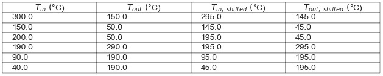
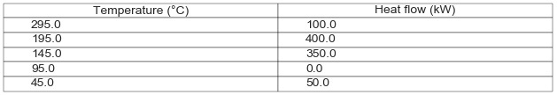
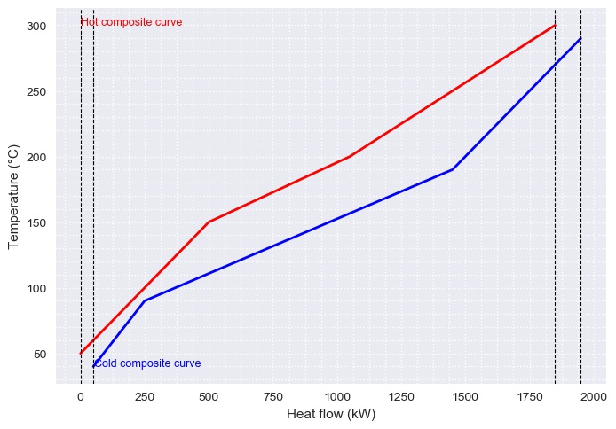

# PinchAnalysis
This application allows calculate heat integration for heat exchangers.

## Usage
This application uses the pinchStream class, which requires attaching a plain text file to the folder where the application is hosted. This class allows to visualize the specifications of the streams and the table of shifted temperatures as well as to generate the composite curve, the grand composite curve and the corresponding heat flow cascade.

## Required information
The plain text file must have the following format and the same order:

* <a href="https://www.codecogs.com/eqnedit.php?latex=\dot{Q}" target="_blank"></a>
* <a href="https://www.codecogs.com/eqnedit.php?latex=T_{min}" target="_blank"></a>
* <a href="https://www.codecogs.com/eqnedit.php?latex=T_{min}" target="_blank"></a>
* <a href="https://www.codecogs.com/eqnedit.php?latex={\Delta&space;T}_{min}" target="_blank"></a>

## How to manipulate the application?

First, the instance of the class is generated using the pinchStream notation ('Data'):

```python
pinchStream('Data')
```

It should be noted that the string 'Data' corresponds to the name of the plain text file. If you want to work on multiple plain text files that contain streams information, their names must vary only numerically, that is, if there is a second file on which you want to perform calculations, it should be called 'Data2' and so on consecutively.

### Calculation examples

**First example**

**Example 15.2** _[Adapted from Analysis, Synthesis and Design of Chemical Processes, Richard Turton, Richard C. Baille, Wallace B. Whiting, Joseph A. Shaeiwitz, page 525]_
In a process, there are a total of six streams that require heating and cooling. These are listed below along with their thermal and flow data. A stream is referred to as "hot" if it requires cooling, and "cold" if it requires heating. The temperature of the stream is not used to define whether it is "hot" or "cold".

Stream | Condition | <a href="https://www.codecogs.com/eqnedit.php?latex=T_{in}&space;\&space;(^{}\circ&space;C)" target="_blank"></a> | <a href="https://www.codecogs.com/eqnedit.php?latex=T_{out}&space;\&space;(^{\circ}&space;C)" target="_blank"></a>| <a href="https://www.codecogs.com/eqnedit.php?latex={\dot{Q}}_{available}&space;\&space;(kW)" target="_blank"></a>
------------ | ------------- | ------------- | ------------- | ------------- |
1 | Hot | 300 | 150 | 1200 |
2 | Hot | 150 | 50 | 200 |
3 | Hot | 200 | 50 | 450 |
4 | Cold | 190 | 290 | -500 |
5 | Cold | 90 | 190 | -800 |
6 | Cold | 40 | 190 | -600 |

Generate the tables corresponding to the specifications of the currents, the temperatures of interval and the cascade of heat flow as well as the graphs of cumulative enthalpies and grand composite.

#### First step
Create the plain text file with the requires information.


#### Second step
Calculate the temperatures corrected by the minimum approach.



#### Third step
Calculate the corresponding heat flow cascade



#### Fourth step
Elaborate the graph of cumulative enthalpies



#### Fifth step
Elaborate the grand composite graphic


**Second example**

**Example 5.4**
**Example 10.2 HENS Problem 4SP1** _[Adapted from SYSTEMATIC METHODS OF CHEMICAL PROCESS DESIGN, L. T. Biegler, I. E. Grossmann, A. W. Westerberg, page X]_
The literature contains several test problems for testing the effectiveness of heat exchanger work synthesis algorithms. Problem 4SP1 (four streams problem number 1) is one of the shall use it to illustrate how to use Hohmann/Lockhart composite curves to compute mixed utility use for a heat exchanger network synthesis problem. Table 10.6 gives the data for the problem.

Stream | Condition | <a href="https://www.codecogs.com/eqnedit.php?latex=T_{in}&space;\&space;(^{}\circ&space;C)" target="_blank"></a> | <a href="https://www.codecogs.com/eqnedit.php?latex=T_{out}&space;\&space;(^{\circ}&space;C)" target="_blank"></a>| <a href="https://www.codecogs.com/eqnedit.php?latex={\dot{Q}}_{available}&space;\&space;(kW)" target="_blank"></a>
------------ | ------------- | ------------- | ------------- | ------------- |
1 | Cold | 60 | 160 | 762.0 |
2 | Cold | 116 | 260 | 875.5 |
3 | Hot | 160 | 93 | 588.9 |
4 | Hot| 249 | 138 | 1171.1 |
